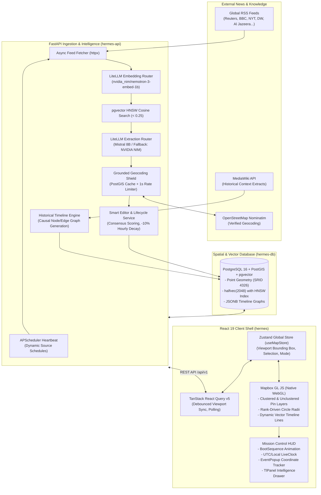

# Hermes: Real-Time Geospatial Intelligence Engine

<div align="center">

```text
  ██╗  ██╗███████╗██████╗ ███╗   ███╗███████╗███████╗
  ██║  ██║██╔════╝██╔══██╗████╗ ████║██╔════╝██╔════╝
  ███████║█████╗  ██████╔╝██╔████╔██║█████╗  ███████╗
  ██╔══██║██╔══╝  ██╔══██╗██║╚██╔╝██║██╔══╝  ╚════██║
  ██║  ██║███████╗██║  ██║██║ ╚═╝ ██║███████╗███████║
  ╚═╝  ╚═╝╚══════╝╚═╝  ╚═╝╚═╝     ╚═╝╚══════╝╚══════╝
```

**Global Situational Awareness & Geospatial News Aggregator**

[](https://nx.dev)
[](https://react.dev)
[](https://reactrouter.com)
[](https://fastapi.tiangolo.com)
[](https://postgis.net)
[-blue?style=flat)](https://github.com/pgvector/pgvector)
[](https://tailwindcss.com)
[](https://docs.mapbox.com/mapbox-gl-js/)

</div>

---

## 📖 Product Vision

**Project Hermes** is an autonomous geospatial intelligence engine designed to combat modern news fatigue. Traditional news feeds bombard users with endless vertical streams of sensationalist text and duplicate reporting. Hermes transforms this paradigm into a unified, interactive **3D geopolitical map and command-center dashboard**. 

Instead of reading disjointed articles, users *observe* world events unfolding in real time:

- **Spatial Grounding**: Incidents are anchored to verified geographical coordinates rather than abstract headlines.
- **Smart Editorial Consensus**: Events compound in significance only when corroborated by multiple independent news outlets across varying credibility tiers.
- **Organic Time Decay**: Fast-breaking events command attention immediately, while stale stories naturally decay and archive over time.
- **Historical Causality**: Users can open any event's intelligence dossier to trace its geopolitical roots through automatically synthesized Wikipedia causal graphs.

---

## 🏛 High-Level Architecture

Hermes is structured as an **Nx monorepo** coupling a high-throughput Python FastAPI backend, a PostGIS spatial database with half-precision vector similarity indexing, and a React 19 WebGL frontend client.



---

## 📂 Workspace Anatomy

Hermes strictly adheres to the **Nx 80/20 Apps-and-Libs pattern**. Applications in `apps/` remain thin deployment shells, while domain logic, map visualization engines, and reusable tactical UI components reside in `libs/`:

```text
hermes/
├── apps/
│   ├── hermes/                    # React 19 + React Router 8 frontend shell (Vite, Tailwind 4)
│   │   ├── app/                   # App root, providers, router configuration, routes
│   │   └── README.md              # Detailed frontend architectural documentation
│   ├── hermes-api/                # FastAPI backend service (Python 3.12, SQLAlchemy 2.0, uv)
│   │   ├── src/hermes_api/        # API routers, models, services, schedulers, core config
│   │   ├── migrations/            # Alembic async migration versions
│   │   ├── tests/                 # Pytest test suite with async fixtures
│   │   └── README.md              # Detailed backend architectural documentation
│   └── hermes-e2e/                # Playwright end-to-end browser test suite
├── libs/
│   ├── feature-map/               # Core Mapbox GL WebGL implementation
│   │   ├── src/lib/ui/            # MapView, EventPopup, TlPanel
│   │   ├── src/lib/store/         # Zustand global map state store (useMapStore)
│   │   └── src/lib/hooks/         # Data synchronization and timeline polling hooks
│   └── shared/
│       ├── ui-components/         # Decoupled Mission Control HUD widgets (BootSequence, LiveClock)
│       ├── util-types/            # Shared TypeScript contracts (MapEventResponse, TlResponse)
│       └── utils/                 # Cross-cutting utility functions
├── docker-compose.yml             # Orchestration for PostGIS/pgvector, API, and Frontend
├── package.json                   # Monorepo dependencies (Nx, React 19, Mapbox, Tailwind 4)
├── tsconfig.base.json             # Absolute path alias mappings (@hermes/feature-map, etc.)
└── nx.json                        # Nx workspace target and generator configuration
```

---

## ⚡ Core Domain Mechanics

### 1. Semantic Deduplication with Halfvec(2048)
To prevent duplicate stories from cluttering the map, incoming RSS articles are batched and embedded into 2048-dimensional vectors using `nvidia_nim/nvidia/nemotron-3-embed-1b`. PostGIS uses `pgvector`'s `halfvec(2048)` storage type paired with an **HNSW index**:
```sql
CREATE INDEX idx_events_embedding ON events 
USING hnsw (embedding halfvec_cosine_ops) 
WITH (m = 16, ef_construction = 64);
```
Articles within a cosine distance `< 0.25` are surfaced as existing candidates. The LLM then merges corroborating reports instead of creating duplicate events.

### 2. Smart Editor Consensus & Time Decay
Events are algorithmically ranked using source credibility tiers:
- **`TIER_1`** (+3.0): Wire services and outlets of record (Reuters, BBC, NYT, WSJ, DW).
- **`TIER_2`** (+2.0): Major regional and global broadcasters (CNN, Al Jazeera, Euronews).
- **`TIER_3`** (+1.0): Standard digital news publishers.
- **`TIER_4`** (+0.5): Aggregators and local outlets.

**Consensus Compounding**: Independent coverage of the same event by multiple outlets rapidly elevates its `trending_score`.  
**Organic Decay**: An hourly background task decays all active events by 10%:
```text
trending_score(t + 1) = trending_score(t) * 0.90
```
Events naturally transition: `ACTIVE` &rarr; `STALE` (24h) &rarr; `ARCHIVED` (48h).

### 3. Zero-Hallucination Geocoding Shield
Generative LLMs are prone to hallucinating latitude and longitude coordinates. Hermes restricts LLM extraction to verified location *names* (`"City, Country"`). These are resolved via OpenStreetMap's Nominatim API, protected by an asynchronous token-bucket rate limiter (strict 1.0s delay lock) and backed by a permanent `geocode_cache` database table.

### 4. Historical Causality Graph (Timeline Engine)
Clicking an event allows analysts to generate an on-demand historical lineage. The backend queries MediaWiki APIs, extracts chronological milestones, geocodes historical sub-events, and links them via causal verbs (`"led to"`, `"retaliated"`, `"triggered"`), culminating in today's active event.

### 5. "Mission Control" UI/UX Language
Hermes embraces a tactical terminal visual identity:
- **Zero Border Radius**: Enforced globally in Tailwind via `corePlugins: { borderRadius: false }`.
- **Monospace Typography**: Styled with `"JetBrains Mono"` and `"Fira Code"`.
- **Native WebGL Layering**: Over 10,000 active pins can be rendered simultaneously via Mapbox circle and symbol layers without DOM node overhead.

---

## 🚀 Getting Started

### Prerequisites

Ensure you have the following installed on your machine:
- **Docker & Docker Compose** (for running PostGIS + pgvector)
- **Node.js** (v20+ or v22 LTS recommended) & **npm**
- **Python** (v3.12 recommended, minimum 3.9+)
- **[uv](https://docs.astral.sh/uv/)** (ultra-fast Python package installer and virtual environment manager)
- **Mapbox Access Token** (free tier token from [mapbox.com](https://account.mapbox.com/))

---

### Step 1: Clone the Repository & Configure Environment

```bash
git clone https://github.com/paavann/hermes.git
cd hermes
```

Create your shared `.env` file in the monorepo root:

```bash
cp .env.example .env # or create .env manually
```

Populate the root `.env`:

```ini
# Database Configuration
DB_NAME=hermes
DB_USER=postgres
DB_PASSWORD=your_secure_password
DB_HOST=localhost
DB_PORT=5432

# Ports
API_PORT=8000
FRONTEND_PORT=4200

# Frontend Configuration
VITE_MAPBOX_TOKEN=pk.your_mapbox_public_token_here
VITE_BASE_URL=http://localhost:8000
VITE_API_VER=v1

# AI & Embedding Providers (Backend)
LLM_API=your_primary_llm_api_key_here
LLM_MODEL=mistral/ministral-8b-latest
LLM_API_1=your_fallback_llm_api_key_here
LLM_MODEL_1=nvidia_nim/mistralai/mistral-nemotron
EMBED_API=your_nvidia_nim_or_embed_key_here
EMBED_MODEL=nvidia_nim/nvidia/nemotron-3-embed-1b
```

---

### Step 2: Install Monorepo Dependencies

Install Node.js dependencies from the workspace root:

```bash
npm install
```

Synchronize Python dependencies for the backend using `uv` via Nx:

```bash
npx nx run hermes-api:sync
```

---

### Step 3: Start the Spatial Database

Start the custom PostGIS container with pgvector:

```bash
docker compose up -d hermes-db
```

Verify that the database is healthy:

```bash
docker compose ps
```

---

### Step 4: Run Database Migrations

Apply all Alembic revisions to establish PostGIS spatial tables and pgvector indexes:

```bash
npx nx migrate hermes-api
```

---

### Step 5: Start Development Servers

You can run both applications concurrently or individually using Nx:

#### Terminal 1 — Backend API:
```bash
npx nx serve hermes-api
```
*API will run on [http://localhost:8000](http://localhost:8000). Interactive Swagger documentation is available at [http://localhost:8000/docs](http://localhost:8000/docs).*

#### Terminal 2 — Frontend Client:
```bash
npx nx dev hermes
```
*Frontend will run on [http://localhost:4200](http://localhost:4200).*

---

### Alternative: Full Docker Compose Launch

To run the entire Hermes stack inside Docker containers:

```bash
docker compose up --build
```

---

## 🛠 Unified Nx Monorepo Workflow

As an Nx monorepo, **all commands must be executed from the monorepo root**:

| Target | Command | Description |
| :--- | :--- | :--- |
| **Serve Frontend** | `npx nx dev hermes` | Starts Vite dev server on port `4200` with HMR |
| **Serve Backend** | `npx nx serve hermes-api` | Starts FastAPI server with Uvicorn auto-reload on port `8000` |
| **Run Migrations** | `npx nx migrate hermes-api` | Executes `alembic upgrade head` |
| **Lint Workspace** | `npx nx run-many -t lint` | Runs ESLint on TypeScript apps/libs and Ruff on Python API |
| **Test Workspace** | `npx nx run-many -t test` | Runs Vitest for frontend units and Pytest for backend services |
| **Build Frontend** | `npx nx build hermes` | Generates production SPA bundle in `apps/hermes/dist` |
| **Build Backend** | `npx nx build hermes-api` | Packages Python distribution wheels |
| **E2E Tests** | `npx nx e2e hermes-e2e` | Runs Playwright browser integration suites |
| **Format Python** | `npx nx run hermes-api:format` | Formats Python code with Ruff |
| **Sync Dependencies** | `npx nx run hermes-api:sync` | Syncs virtualenv with `uv.lock` |
| **Project Graph** | `npx nx graph` | Launches visual interactive dependency graph |

---

## 🧩 Tech Stack Matrix

| Domain | Technology | Purpose |
| :--- | :--- | :--- |
| **Frontend Shell** | [React 19](https://react.dev/) | Declarative UI rendering |
| **Routing** | [React Router 8](https://reactrouter.com/) | Client-side SPA routing (`ssr: false`) |
| **Styling** | [Tailwind CSS 4](https://tailwindcss.com/) | Tactical "Mission Control" design language |
| **Geospatial Engine** | [Mapbox GL JS v3](https://docs.mapbox.com/mapbox-gl-js/) | Native WebGL layer rendering & clustering |
| **Client State** | [Zustand](https://github.com/pmndrs/zustand) | Global map viewport & telemetry store |
| **Server State** | [TanStack Query v5](https://tanstack.com/query/latest) | Debounced bounding-box queries & graph polling |
| **Backend Framework** | [FastAPI](https://fastapi.tiangolo.com/) | Asynchronous REST API service |
| **ORM & Spatial** | [SQLAlchemy 2.0 Async](https://www.sqlalchemy.org/) + [GeoAlchemy2](https://geoalchemy-2.readthedocs.io/) | Spatial queries & database mapping |
| **Spatial Database** | [PostgreSQL 16](https://www.postgresql.org/) + [PostGIS 3.4](https://postgis.net/) | Native geospatial queries (`ST_Within`, `ST_MakeEnvelope`) |
| **Vector Engine** | [pgvector](https://github.com/pgvector/pgvector) | Half-precision (`halfvec(2048)`) HNSW indexing |
| **AI Orchestration** | [LiteLLM](https://docs.litellm.ai/) | Multi-model router with automated fallbacks |
| **Scheduler** | [APScheduler](https://apscheduler.readthedocs.io/) | Background news harvesting & decay lifecycle |
| **Packaging** | [uv](https://docs.astral.sh/uv/) + [Nx](https://nx.dev/) | Blazing-fast dependency resolution |

---

## 📚 App Documentation Links

For deeper application-specific implementation details:

- **[Frontend Architecture Guide (`apps/hermes/README.md`)](file:///home/pavan/proj/hermes/apps/hermes/README.md)**: WebGL layer specs, coordinate projection logic, and HUD component guides.
- **[Backend Architecture Guide (`apps/hermes-api/README.md`)](file:///home/pavan/proj/hermes/apps/hermes-api/README.md)**: Ingestion pipeline, semantic deduplication, timeline synthesis, and database ERD.

---

## 📄 License

This project is licensed under the MIT License — see the [LICENSE](file:///home/pavan/proj/hermes/LICENSE) file for details.
