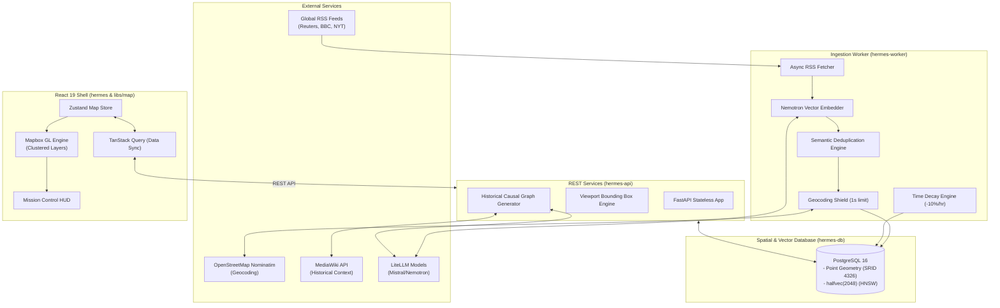

# Hermes: Real-Time Geospatial Intelligence Engine

<div align="center">

```text
  ██╗  ██╗███████╗██████╗ ███╗   ███╗███████╗███████╗
  ██║  ██║██╔════╝██╔══██╗████╗ ████║██╔════╝██╔════╝
  ███████║█████╗  ██████╔╝██╔████╔██║█████╗  ███████╗
  ██╔══██║██╔══╝  ██╔══██╗██║╚██╔╝██║██╔══╝  ╚════██║
  ██║  ██║███████╗██║  ██║██║ ╚═╝ ██║███████╗███████║
  ╚═╝  ╚═╝╚══════╝╚═╝  ╚═╝╚═╝     ╚═╝╚══════╝╚══════╝
```

**Global Situational Awareness & Geospatial News Aggregator**

[](https://nx.dev)
[](https://react.dev)
[](https://reactrouter.com)
[](https://fastapi.tiangolo.com)
[](https://postgis.net)
[-blue?style=flat)](https://github.com/pgvector/pgvector)
[](https://tailwindcss.com)
[](https://docs.mapbox.com/mapbox-gl-js/)

</div>

---

## Product Vision

Project Hermes is an autonomous geospatial intelligence engine designed to combat modern news fatigue. Traditional news feeds bombard users with endless vertical streams of sensationalist text and duplicate reporting. Hermes transforms this paradigm into a unified, interactive 3D geopolitical map and command-center dashboard.

Instead of reading disjointed articles, users observe world events unfolding in real time:

- **Spatial Grounding**: Incidents are anchored to verified geographical coordinates rather than abstract headlines.
- **Smart Editorial Consensus**: Events compound in significance only when corroborated by multiple independent news outlets across varying credibility tiers.
- **Organic Time Decay**: Fast-breaking events command attention immediately, while stale stories naturally decay and archive over time.
- **Historical Causality**: Users can open any event's intelligence dossier to trace its geopolitical roots through automatically synthesized Wikipedia causal graphs.

---

## High-Level Architecture

Hermes is structured as an Nx monorepo coupling a high-throughput Python FastAPI backend, an autonomous Python worker for ingestion, a PostGIS spatial database with half-precision vector similarity indexing, and a React 19 WebGL frontend client.


```mermaid
flowchart TD
    subgraph External["External Services"]
        RSS["Global RSS Feeds
(Reuters, BBC, NYT)"]
        OSM["OpenStreetMap Nominatim
(Geocoding)"]
        Wiki["MediaWiki API
(Historical Context)"]
        LLM["LiteLLM Models
(Mistral/Nemotron)"]
    end

    subgraph Worker["Ingestion Worker (hermes-worker)"]
        IngestionEngine["Async RSS Fetcher"]
        VectorEmbedder["Nemotron Vector Embedder"]
        EventDeduplicator["Semantic Deduplication Engine"]
        GeoShield["Geocoding Shield (1s limit)"]
        LifecycleManager["Time Decay Engine (-10%/hr)"]
    end

    subgraph API["REST Services (hermes-api)"]
        FastAPI["FastAPI Stateless App"]
        BoundingBoxQuerier["Viewport Bounding Box Engine"]
        TimelineSynthesizer["Historical Causal Graph Generator"]
    end

    subgraph Database["Spatial & Vector Database (hermes-db)"]
        PostGIS[("PostgreSQL 16
- Point Geometry (SRID 4326)
- halfvec(2048) (HNSW)")]
    end

    subgraph Frontend["React 19 Shell (hermes & libs/map)"]
        Store["Zustand Map Store"]
        Query["TanStack Query (Data Sync)"]
        WebGL["Mapbox GL Engine
(Clustered Layers)"]
        HUD["Mission Control HUD"]
    end

    RSS --> IngestionEngine
    IngestionEngine --> VectorEmbedder
    VectorEmbedder <--> LLM
    VectorEmbedder --> EventDeduplicator
    EventDeduplicator --> GeoShield
    GeoShield <--> OSM
    GeoShield --> PostGIS
    LifecycleManager --> PostGIS

    API <--> PostGIS
    TimelineSynthesizer <--> Wiki
    TimelineSynthesizer <--> LLM

    Store <--> Query
    Query <-->|REST API| API
    Store --> WebGL
    WebGL --> HUD
```

---

## Workspace Anatomy

Hermes strictly adheres to the Nx 80/20 Apps-and-Libs pattern. Applications in `apps/` remain thin deployment shells, while domain logic, map visualization engines, and reusable tactical UI components reside in `libs/`:

```text
hermes/
├── apps/
│   ├── hermes/                    # React 19 + React Router 8 frontend shell (Vite, Tailwind 4)
│   ├── hermes-api/                # FastAPI backend service (Python, SQLAlchemy 2.0, uv)
│   ├── hermes-worker/             # Python CLI worker for ingestion and scheduled tasks
│   └── hermes-e2e/                # Playwright end-to-end browser test suite
├── libs/
│   ├── map/                       # Core Mapbox GL WebGL implementation (libs/map)
│   └── shared/
│       ├── hermes-db/             # Shared PostGIS models and alembic migrations
│       ├── ui-components/         # Decoupled Mission Control HUD widgets
│       ├── util-types/            # Shared TypeScript contracts
│       └── utils/                 # Cross-cutting utility functions
├── docker-compose.yml             # Orchestration for PostGIS/pgvector
├── package.json                   # Monorepo Node dependencies
├── pyproject.toml                 # Monorepo Python config (ruff, dependencies)
└── nx.json                        # Nx workspace target configuration
```

---

## Core Domain Mechanics

### 1. Semantic Deduplication with Halfvec(2048)
To prevent duplicate stories from cluttering the map, incoming RSS articles are batched and embedded into 2048-dimensional vectors. PostGIS uses `pgvector`'s `halfvec(2048)` storage type paired with an HNSW index. Articles within a cosine distance `< 0.25` are surfaced as existing candidates. The LLM then merges corroborating reports instead of creating duplicate events.

### 2. Smart Editor Consensus & Time Decay
Events are algorithmically ranked using source credibility tiers. Independent coverage of the same event by multiple outlets rapidly elevates its trending score. An hourly background task in the worker decays all active events by 10%, ensuring stale stories archive naturally.

### 3. Zero-Hallucination Geocoding Shield
Generative LLMs are prone to hallucinating latitude and longitude coordinates. Hermes restricts LLM extraction to verified location names. These are resolved via OpenStreetMap's Nominatim API, protected by an asynchronous token-bucket rate limiter and backed by a permanent `geocode_cache` database table.

### 4. Historical Causality Graph (Timeline Engine)
Clicking an event allows analysts to generate an on-demand historical lineage. The backend queries MediaWiki APIs, extracts chronological milestones, geocodes historical sub-events, and links them via causal verbs, culminating in today's active event.

### 5. Tactical UI/UX Language
Hermes embraces a tactical terminal visual identity:
- Zero Border Radius
- Monospace Typography (JetBrains Mono)
- Native WebGL Layering for massive scale

---

## Getting Started

### Prerequisites

- Docker & Docker Compose
- Node.js v22 LTS & npm
- Python 3.12+
- `uv` Python package manager
- Mapbox Access Token

### Environment Setup

Create `.env` in the monorepo root:

```ini
DB_NAME=hermes
DB_USER=postgres
DB_PASSWORD=secret
DB_HOST=localhost
DB_PORT=5432
API_PORT=8000
FRONTEND_PORT=4200
VITE_MAPBOX_TOKEN=your_mapbox_token
VITE_BASE_URL=http://localhost:8000
VITE_API_VER=v1
```

Create `.env.local` inside `apps/hermes-api` and `apps/hermes-worker`:

```ini
LLM_API=your_llm_key
LLM_MODEL=mistral/ministral-8b-latest
EMBED_API=your_nvidia_nim_key
EMBED_MODEL=nvidia_nim/nvidia/nemotron-3-embed-1b
```

### Installation & Launch

1. Install Node dependencies: `npm install`
2. Sync Python backend: `npx nx run hermes-api:sync` and `npx nx run hermes-worker:sync`
3. Start Database: `docker compose up -d hermes-db`
4. Run Migrations: `npx nx migrate hermes-api`
5. Start API: `npx nx serve hermes-api`
6. Start Frontend: `npx nx dev hermes`
7. Start Worker: `npx nx run hermes-worker:run`

---

## Documentation Index

Explore deep architectural dives in project-specific documentation:

- [apps/hermes-api/README.md](file:///home/pavan/proj/hermes/apps/hermes-api/README.md)
- [apps/hermes/README.md](file:///home/pavan/proj/hermes/apps/hermes/README.md)
- [apps/hermes-worker/README.md](file:///home/pavan/proj/hermes/apps/hermes-worker/README.md)
- [libs/shared/hermes-db/README.md](file:///home/pavan/proj/hermes/libs/shared/hermes-db/README.md)
- [libs/map/README.md](file:///home/pavan/proj/hermes/libs/map/README.md)
