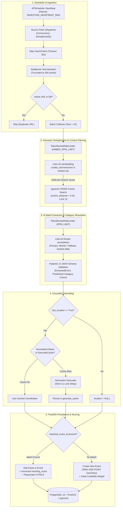
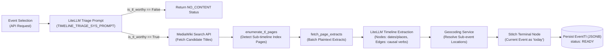
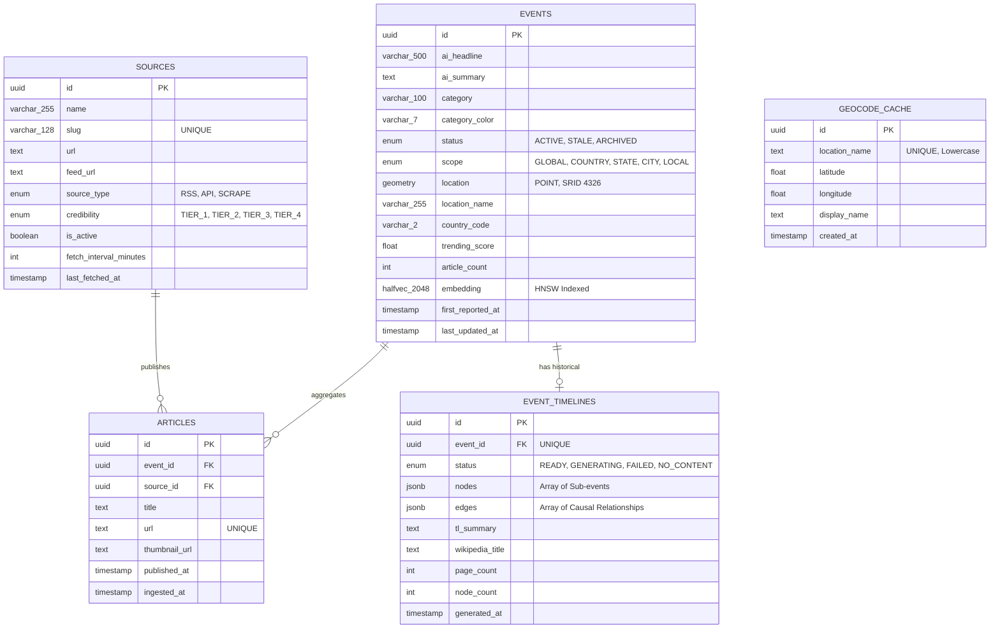

# Hermes API (`hermes-api`)

**Hermes API** is the autonomous backend engine and geospatial intelligence service for [Project Hermes](file:///home/pavan/proj/hermes/README.md). It ingests, sanitizes, deduplicates, and geospatially anchors global news events in real time.

Built on **Python 3.12**, **FastAPI**, **SQLAlchemy 2.0 (Async)**, **PostGIS**, **pgvector**, and **LiteLLM**, the service eliminates AI coordinate hallucinations by coupling LLM-based entity extraction with a persistent, rate-limited geocoding pipeline. It also features an on-demand historical timeline engine that synthesizes MediaWiki extracts into interactive causal event graphs.

---

## Table of Contents

- [1. System Architecture](#1-system-architecture)
  - [Ingestion & Deduplication Pipeline](#ingestion--deduplication-pipeline)
  - [Historical Timeline (Lineage) Engine](#historical-timeline-lineage-engine)
- [2. Core Algorithms & Domain Mechanics](#2-core-algorithms--domain-mechanics)
  - [Semantic Deduplication with Half-Precision Embeddings](#semantic-deduplication-with-half-precision-embeddings)
  - [Smart Editor Scoring & Time Decay Lifecycle](#smart-editor-scoring--time-decay-lifecycle)
  - [Zero-Hallucination Geocoding Shield](#zero-hallucination-geocoding-shield)
  - [Resilient Multi-Model LLM Routing](#resilient-multi-model-llm-routing)
- [3. Codebase Anatomy & Module Organization](#3-codebase-anatomy--module-organization)
- [4. Database Architecture & Schema](#4-database-architecture--schema)
  - [Entity-Relationship Diagram](#entity-relationship-diagram)
  - [Table Definitions & Indexing](#table-definitions--indexing)
- [5. API Reference](#5-api-reference)
  - [Healthcheck](#healthcheck)
  - [Events API](#events-api)
  - [Timeline API](#timeline-api)
  - [Error Format](#error-format)
- [6. Configuration & Environment Variables](#6-configuration--environment-variables)
- [7. Operational Guide: Managing News Sources](#7-operational-guide-managing-news-sources)
- [8. Development & Nx Monorepo Workflow](#8-development--nx-monorepo-workflow)

---

## 1. System Architecture

### Ingestion & Deduplication Pipeline

The service periodically harvests global RSS feeds on an autonomous schedule. Rather than sending every raw article to costly generative LLMs, it uses a multi-tier filtering funnel:



---

### Historical Timeline (Lineage) Engine

When an event is investigated on the frontend map, the `/events/tl/{event_id}` endpoint synthesizes an interactive causal event graph:



---

## 2. Core Algorithms & Domain Mechanics

### Semantic Deduplication with Half-Precision Embeddings

- **Vector Dimension**: `2048` dimensions generated via `nvidia_nim/nvidia/nemotron-3-embed-1b`.
- **Half-Precision Storage**: Stored as `HALFVEC(2048)` in PostgreSQL using `pgvector`. This cuts memory usage by 50% compared to standard single-precision `vector(2048)` while retaining high indexing precision.
- **Index Specification**:
  ```sql
  CREATE INDEX idx_events_embedding ON events 
  USING hnsw (embedding halfvec_cosine_ops) 
  WITH (m = 16, ef_construction = 64);
  ```
- **Similarity Threshold**: Articles with cosine distance `< 0.25` are retrieved as candidates and passed to the LLM context for matching.

---

### Smart Editor Scoring & Time Decay Lifecycle

Hermes algorithmically ranks events so the primary map view highlights critical global news without visual clutter.

1. **Credibility Weights by Source**:
   - `TIER_1` (e.g. BBC, NYT, Reuters, WSJ): `+3.0` points
   - `TIER_2` (e.g. CNN, Al Jazeera, Euronews): `+2.0` points
   - `TIER_3` (Regional / Standard Outlets): `+1.0` point
   - `TIER_4` (Aggregators / Tabloids): `+0.5` points
2. **Consensus Compounding**:
   When multiple outlets report the same breaking incident, their respective credibility scores are summed directly into `event.trending_score`.
3. **Decay Formulation**:
   Every 60 minutes, `run_event_lifecycle_job()` executes an automated decay statement across all `ACTIVE` events:
   ```text
   trending_score(t + 1) = trending_score(t) * 0.90
   ```
4. **Lifecycle State Transitions**:
   - **`ACTIVE` &rarr; `STALE`**: Triggered when `NOW() - last_updated_at > EVENT_STALE_HOURS` (default: 24h).
   - **`STALE` &rarr; `ARCHIVED`**: Triggered when `NOW() - last_updated_at > EVENT_ARCHIVE_HOURS` (default: 48h).
   - **Reactivation**: If a new article matches a `STALE` event, its status is immediately restored to `ACTIVE`.

---

### Zero-Hallucination Geocoding Shield

LLMs frequently hallucinate precise latitude and longitude coordinates. Hermes eliminates this by restricting the LLM to outputting verified location strings (`"City, Country"`).

- **Cache Layer**: Checked against `geocode_cache` by normalized key (`location_name.strip().lower()`).
- **Negative Caching**: Unresolvable locations store `NULL` coordinates to prevent repeated lookups.
- **Nominatim Protection**: When a network query is required, an `asyncio.Lock()` enforces a mandatory 1.0-second delay between requests alongside a custom `User-Agent` header to maintain compliance with OpenStreetMap usage policies.

---

### Resilient Multi-Model LLM Routing

AI operations run through `litellm.Router`:
- **Primary Model**: Mistral Ministral 8B (`mistral/ministral-8b-latest`)
- **Fallback Model**: NVIDIA NIM Mistral Nemotron (`nvidia_nim/mistralai/mistral-nemotron`)
- **Fault Tolerance**: Automatic failover after 2 retries, a 180-second cooldown on rate-limited endpoints, and explicit exponential backoff (`retry_after=True`).
- **Structured Outputs**: All LLM calls enforce Pydantic JSON schemas via `response_format={"type": "json_schema"}`.

---

## 3. Codebase Anatomy & Module Organization

```text
apps/hermes-api/
├── Dockerfile                     # Multi-stage production container running uv & uvicorn
├── alembic.ini                    # Database migration configuration
├── pyproject.toml                 # uv package declarations, dependencies, Ruff lint configs
├── project.json                   # Nx target definitions (serve, test, lint, migrate, format)
├── migrations/
│   ├── env.py                     # Alembic async migration environment
│   └── versions/                  # Revision scripts (indexes, schemas, halfvec migration)
├── tests/
│   ├── conftest.py                # Pytest async configuration
│   ├── test_ai_service.py         # AI extraction & embedding unit tests
│   ├── test_rate_limiter.py       # Token-bucket rate limiter tests
│   ├── test_source_service.py     # Declarative sources.json sync tests
│   ├── test_tl_service.py         # Timeline generation and graph synthesis tests
│   └── test_wikipedia_service.py  # MediaWiki search and page extraction tests
└── src/hermes_api/
    ├── main.py                    # App factory, lifespan context, CORS, error handling
    ├── api/v1/
    │   ├── router.py              # Root APIRouter with standardized error responses
    │   ├── events.py              # /events endpoints (feed, bounding box, details)
    │   └── tl.py                  # /events/tl timeline generation endpoints
    ├── core/
    │   ├── config.py              # Pydantic Settings (keys, models, rate limits, db_url)
    │   ├── constants.py           # 10 core event categories with fixed hex colors
    │   ├── errors.py              # Global exception handlers (AppException, Validation, 500)
    │   ├── exceptions.py          # Custom domain exceptions (EventNotFound, WikiSearchException)
    │   ├── logger.py              # Structured logging configuration
    │   ├── rate_limiter.py        # TokenBucketRateLimiter async implementation
    │   └── sources.json           # Declarative news feed configuration
    ├── db/
    │   ├── base.py                # DeclarativeBase, UUIDPrimaryKeyMixin, TimestampMixin
    │   ├── db.py                  # Async engine and AsyncSessionLocal session factory
    │   ├── enums.py               # EventStatus, EventScope, CredibilityTier, EventTlStatus
    │   └── models/
    │       ├── event.py           # Event model with Point geometry & halfvec(2048) embedding
    │       ├── article.py         # Ingested article linked to parent event and source
    │       ├── source.py          # News outlet metadata, fetch cadences, credibility tier
    │       ├── geocode_cache.py   # Cached normalized coordinates
    │       └── event_tl.py        # Historical timeline graph (JSONB nodes and edges)
    ├── schemas/
    │   ├── events.py              # Pydantic v2 DTOs (EventResponse, MapEventResponse, TlResponse)
    │   └── errors.py              # Standard error schemas (ErrorResponseSchema)
    ├── services/
    │   ├── ai_service.py          # LiteLLM router, extraction prompts, batch embeddings
    │   ├── event_service.py       # Event creation, merging, scoring, lifecycle transitions
    │   ├── geocoding_service.py   # Cached Nominatim geocoder
    │   ├── ingestion_service.py   # Feed parsing, batching, deduplication pipeline
    │   ├── rss_service.py         # Async RSS fetcher and text extractor
    │   ├── source_service.py      # Declarative source synchronization from sources.json
    │   ├── tl_service.py          # Wikipedia context retrieval & timeline synthesis
    │   └── wikipedia_service.py   # MediaWiki API integration and batch extract fetcher
    ├── scheduler/
    │   └── jobs.py                # APScheduler worker definitions (ingestion, lifecycle decay)
    └── utils/
        └── db.py                  # Database transaction helpers (delete_and_commit)
```

---

## 4. Database Architecture & Schema

### Entity-Relationship Diagram



---

## 5. API Reference

Base URL prefix: `/api/v1`

### Healthcheck

#### `GET /`
- **Description**: Lightweight health and liveness probe.
- **Response `200 OK`**:
  ```json
  {
    "message": "hermes is running..."
  }
  ```

---

### Events API

#### `GET /api/v1/events/`
- **Description**: Returns top active events ordered by `trending_score` descending.
- **Query Parameters**:
  - `status` (*string*, optional, default: `"ACTIVE"`): `"ACTIVE"`, `"STALE"`, or `"ARCHIVED"`.
  - `scope` (*string*, optional): `"GLOBAL"`, `"COUNTRY"`, `"STATE"`, `"CITY"`, or `"LOCAL"`.
  - `limit` (*integer*, optional, default: `50`, min: `1`, max: `200`): Maximum results to return.
- **Response `200 OK`**:
  ```json
  [
    {
      "id": "7f1d43a2-b91c-4b62-9e20-92849e7b2311",
      "ai_headline": "Diplomatic Summit Concludes with Historic Trade Framework",
      "category": "ECONOMY",
      "category_color": "#22C55E",
      "location_name": "Geneva, Switzerland",
      "trending_score": 8.1,
      "article_count": 3,
      "status": "ACTIVE",
      "first_reported_at": "2026-09-23T00:15:00Z",
      "last_updated_at": "2026-09-23T01:30:00Z"
    }
  ]
  ```

#### `GET /api/v1/events/bbox`
- **Description**: Spatial bounding box query for map viewports. Returns lightweight pin data within the specified coordinates using PostGIS `ST_Within(location, ST_MakeEnvelope(...))`.
- **Query Parameters**:
  - `north` (*float*, required, range: `-90` to `90`): Northern latitude.
  - `south` (*float*, required, range: `-90` to `90`): Southern latitude.
  - `east` (*float*, required, range: `-180` to `180`): Eastern longitude.
  - `west` (*float*, required, range: `-180` to `180`): Western longitude.
- **Response `200 OK`**:
  ```json
  [
    {
      "id": "7f1d43a2-b91c-4b62-9e20-92849e7b2311",
      "ai_headline": "Diplomatic Summit Concludes with Historic Trade Framework",
      "category": "ECONOMY",
      "category_color": "#22C55E",
      "location_name": "Geneva, Switzerland",
      "latitude": 46.2044,
      "longitude": 6.1432,
      "trending_score": 8.1,
      "article_count": 3
    }
  ]
  ```

#### `GET /api/v1/events/{event_id}`
- **Description**: Returns detailed event data, including full AI summary and associated source articles.
- **Path Parameters**:
  - `event_id` (*UUID*, required): The event unique identifier.
- **Response `200 OK`**:
  ```json
  {
    "id": "7f1d43a2-b91c-4b62-9e20-92849e7b2311",
    "ai_headline": "Diplomatic Summit Concludes with Historic Trade Framework",
    "ai_summary": "Ministers reached consensus on a multi-lateral trade framework aimed at reducing tariffs across renewable energy components.",
    "category": "ECONOMY",
    "category_color": "#22C55E",
    "location_name": "Geneva, Switzerland",
    "trending_score": 8.1,
    "article_count": 3,
    "status": "ACTIVE",
    "first_reported_at": "2026-09-23T00:15:00Z",
    "last_updated_at": "2026-09-23T01:30:00Z",
    "articles": [
      {
        "id": "a2b3c4d5-e6f7-4890-abcd-ef1234567890",
        "title": "Geneva Accord Reached on Green Technology Trade",
        "url": "https://www.reuters.com/business/geneva-accord-2026",
        "published_at": "2026-09-23T00:10:00Z"
      }
    ]
  }
  ```

---

### Timeline API

#### `POST /api/v1/events/tl/{event_id}`
- **Description**: Initiates or retrieves an on-demand historical timeline contextualizing the target event.
- **Path Parameters**:
  - `event_id` (*UUID*, required): The event unique identifier.
- **Query Parameters**:
  - `force_refresh` (*boolean*, optional, default: `false`): Bypasses cached results and regenerates from Wikipedia.
- **Response `200 OK`**:
  ```json
  {
    "status": "READY",
    "message": null,
    "tl_summary": "Historical origins of trade relations leading to the 2026 accords.",
    "generated_at": "2026-09-23T01:45:00Z",
    "nodes": [
      {
        "id": "3c7b2190-6db7-44a6-932b-3121cf3e098a",
        "date": "1995-01-01",
        "headline": "Establishment of the World Trade Organization",
        "summary": "The Marrakesh Agreement establishes the WTO in Geneva.",
        "location_name": "Geneva, Switzerland",
        "latitude": 46.2044,
        "longitude": 6.1432,
        "category_color": null
      },
      {
        "id": "current-event",
        "date": "2026-09-23",
        "headline": "Diplomatic Summit Concludes with Historic Trade Framework",
        "summary": "Ministers reached consensus on a multi-lateral trade framework.",
        "location_name": "Geneva, Switzerland",
        "latitude": 46.2044,
        "longitude": 6.1432,
        "category_color": "#22C55E"
      }
    ],
    "edges": [
      {
        "source_node_id": "3c7b2190-6db7-44a6-932b-3121cf3e098a",
        "target_node_id": "current-event",
        "relationship": "led to"
      }
    ]
  }
  ```

---

### Error Format

The API standardizes error handling via [`register_err_handlers`](file:///home/pavan/proj/hermes/apps/hermes-api/src/hermes_api/core/errors.py):

```json
{
  "err_code": "EVENT_NOT_FOUND",
  "err_msg": "The requested event could not be found.",
  "details": {
    "event_id": "7f1d43a2-b91c-4b62-9e20-92849e7b2311"
  }
}
```

Common error codes:
- `EVENT_NOT_FOUND` (404)
- `VALIDATION_ERROR` (422)
- `WIKIPEDIA_SEARCH_ERROR` (502)
- `TIMELINE_GENERATION_ERROR` (500)
- `INTERNAL_SERVER_ERROR` (500)

---

## 6. Configuration & Environment Variables

Settings are managed via `pydantic-settings` in [`config.py`](file:///home/pavan/proj/hermes/apps/hermes-api/src/hermes_api/core/config.py) and can be set in the workspace `.env` or `apps/hermes-api/.env.local`.

| Variable | Type | Default | Description |
| :--- | :--- | :--- | :--- |
| `DB_HOST` | `str` | `"localhost"` | PostgreSQL database host |
| `DB_PORT` | `int` | `5432` | PostgreSQL database port |
| `DB_USER` | `str` | `"postgres"` | Database username |
| `DB_PASSWORD` | `str` | `""` | Database password |
| `DB_NAME` | `str` | `"hermes"` | Database name |
| `LLM_API` | `str` | `""` | Primary LLM API key |
| `LLM_MODEL` | `str` | `"mistral/ministral-8b-latest"` | Primary extraction model identifier |
| `LLM_API_1` | `str` | `None` | Secondary/Fallback LLM API key |
| `LLM_MODEL_1` | `str` | `"nvidia_nim/mistralai/mistral-nemotron"` | Fallback extraction model identifier |
| `EMBED_API` | `str` | `""` | Embedding API key |
| `EMBED_MODEL` | `str` | `"nvidia_nim/nvidia/nemotron-3-embed-1b"` | 2048-dimensional embedding model |
| `RPM_LIMIT` | `int` | `26` | Token-bucket rate limit for generation calls |
| `EMBED_RPM_LIMIT` | `int` | `90` | Token-bucket rate limit for embedding calls |
| `NOMINATIM_USER_AGENT` | `str` | `"hermes-api"` | User-Agent sent to OpenStreetMap Nominatim |
| `RSS_FETCH_INTERVAL_MIN`| `int` | `15` | Default fallback RSS polling interval |
| `INGESTION_HEARTBEAT_MIN`| `int` | `360` | Scheduler heartbeat cadence in minutes |
| `EVENT_STALE_HOURS` | `int` | `24` | Inactivity threshold before an event becomes `STALE` |
| `EVENT_ARCHIVE_HOURS` | `int` | `48` | Inactivity threshold before an event is `ARCHIVED` |

---

## 7. Operational Guide: Managing News Sources

News feeds are declared in [`sources.json`](file:///home/pavan/proj/hermes/apps/hermes-api/src/hermes_api/core/sources.json). The API synchronizes this file with the `sources` database table automatically upon server startup via [`sync_sources_from_config`](file:///home/pavan/proj/hermes/apps/hermes-api/src/hermes_api/services/source_service.py).

### Adding a New Feed

Append a new entry to `sources.json`:

```json
{
  "slug": "reuters-world",
  "name": "Reuters World News",
  "url": "https://www.reuters.com/world",
  "feed_url": "https://www.reutersagency.com/feed/?taxonomy=best-topics&post_type=best",
  "credibility": "TIER_1"
}
```

- **Slug**: Unique identifier. Existing slugs are updated in place.
- **Credibility**: Choose between `TIER_1`, `TIER_2`, `TIER_3`, or `TIER_4`.
- **Soft Deletion**: If a source is removed from `sources.json`, the synchronization service marks `is_active = False` in the database, preserving all historic article relationships without cascading deletes.

---

## 8. Development & Nx Monorepo Workflow

As part of the Hermes Nx monorepo, **all commands must be executed from the monorepo root**:

```bash
# 1. Start PostGIS + pgvector database
docker compose up -d hermes-db

# 2. Run database migrations to head
npx nx migrate hermes-api

# 3. Start development server with hot-reload
npx nx serve hermes-api

# 4. Run test suite with pytest & coverage
npx nx test hermes-api

# 5. Run linting & type checks with Ruff
npx nx lint hermes-api

# 6. Format codebase with Ruff
npx nx run hermes-api:format

# 7. Update uv lockfile or sync virtualenv dependencies
npx nx run hermes-api:lock
npx nx run hermes-api:sync
```
