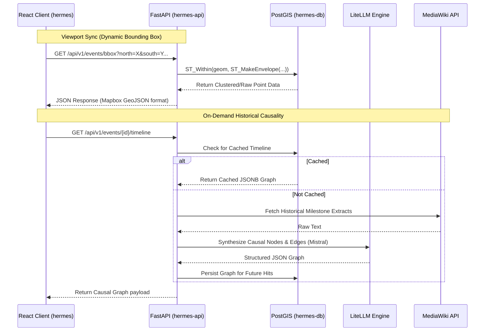

# Hermes API (Backend Service)

The `hermes-api` is a highly performant, stateless RESTful service built with Python 3.14 and FastAPI. It acts as the critical bridge between the PostGIS database and the React client shell, serving hyper-local geospatial data and synthesizing historical timelines on demand.

---

## Architectural Role

In the 12-factor architecture of the Hermes platform, this service strictly handles **read and synthesis** operations. Data ingestion, LLM embedding, and heavy background processing are delegated to the `hermes-worker` service.

This separation of concerns ensures that the REST API remains highly responsive for map viewport queries, even during intensive global news ingestion spikes.

### System Interaction Graph


```mermaid
sequenceDiagram
    participant Client as React Client (hermes)
    participant API as FastAPI (hermes-api)
    participant DB as PostGIS (hermes-db)
    participant LLM as LiteLLM Engine
    participant Wiki as MediaWiki API

    Note over Client,API: Viewport Sync (Dynamic Bounding Box)
    Client->>API: GET /api/v1/events/bbox?north=X&south=Y...
    API->>DB: ST_Within(geom, ST_MakeEnvelope(...))
    DB-->>API: Return Clustered/Raw Point Data
    API-->>Client: JSON Response (Mapbox GeoJSON format)

    Note over Client,Wiki: On-Demand Historical Causality
    Client->>API: GET /api/v1/events/{id}/timeline
    API->>DB: Check for Cached Timeline
    alt Cached
        DB-->>API: Return Cached JSONB Graph
    else Not Cached
        API->>Wiki: Fetch Historical Milestone Extracts
        Wiki-->>API: Raw Text
        API->>LLM: Synthesize Causal Nodes & Edges (Mistral)
        LLM-->>API: Structured JSON Graph
        API->>DB: Persist Graph for Future Hits
    end
    API-->>Client: Return Causal Graph payload
```

---

## Core Features & Endpoints

### 1. Viewport Bounding-Box Queries

As the user pans and zooms across the globe on the frontend, the client emits debounced bounding-box queries to the API.
The API translates these bounds into PostGIS `ST_MakeEnvelope` spatial intersections, returning only the most critical events occurring precisely within the user's field of view.

### 2. On-Demand Timeline Synthesis

When a user investigates a specific event, the API powers the timeline drawer by generating a historical causality graph. If the timeline is missing, the API orchestrates a pipeline involving MediaWiki data extraction and LiteLLM prompt engineering to derive a chronological sequence of events, caching the result in PostgreSQL as JSONB.

### 3. Event Investigation & Detail Retrieval

Provides rich, augmented details for specific events, including semantic summaries, original source URLs, and geographical confirmation metrics.

---

## Configuration & Environment Variables

The application relies on `.env.local` for sensitive credentials and `.env` for shared database configurations.

| Variable                  | Description                                                  |
| :------------------------ | :----------------------------------------------------------- |
| `DB_USER` / `DB_PASSWORD` | PostgreSQL connection credentials.                           |
| `DB_HOST` / `DB_PORT`     | Database networking.                                         |
| `DB_NAME`                 | Database schema name (`hermes`).                             |
| `LLM_API`                 | Primary LLM provider key for timeline synthesis.             |
| `LLM_MODEL`               | Specific model string (e.g., `mistral/ministral-8b-latest`). |

---

## Code Structure

```text
apps/hermes-api/
├── src/
│   ├── hermes_api/
│   │   ├── api/            # FastAPI Router definitions (e.g., /api/v1/events)
│   │   ├── core/           # Configuration, dependency injection (get_db)
│   │   ├── schemas/        # Pydantic response and request validation models
│   │   └── services/       # Business logic, timeline generation, spatial queries
├── tests/                  # Pytest fixtures and async endpoint coverage
├── .env.local              # Local environment overrides
└── pyproject.toml          # Uv dependency specifications
```

---

## Development Workflow

Execute from the workspace root:

| Target           | Command                        | Description                                      |
| :--------------- | :----------------------------- | :----------------------------------------------- |
| **Start Server** | `npx nx serve hermes-api`      | Run Uvicorn dev server on port 8000 with reload. |
| **Sync Deps**    | `npx nx run hermes-api:sync`   | Update Python dependencies via `uv`.             |
| **Run Tests**    | `npx nx test hermes-api`       | Execute Pytest suite.                            |
| **Format Code**  | `npx nx run hermes-api:format` | Format with Ruff.                                |
