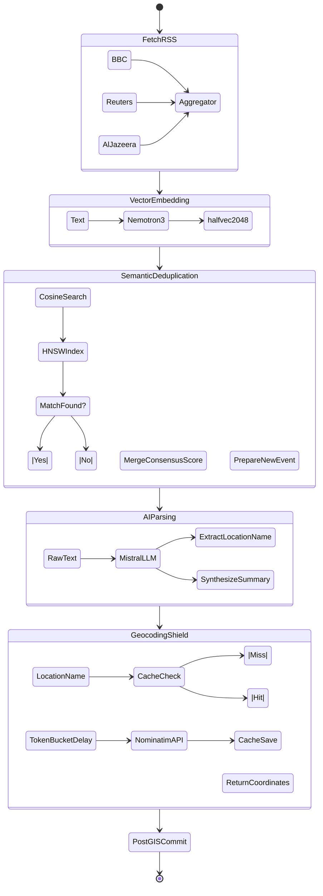

# Hermes Ingestion Worker

The `hermes-worker` is a critical backend daemon responsible for autonomously fetching, processing, embedding, and geocoding global news streams. It operates entirely independently of the REST API, ensuring that heavy LLM extraction and vector operations do not block client map interactions.

---

## Architecture & Responsibilities

This worker runs as a continuous CLI process, orchestrating a complex data pipeline. It leverages external APIs, sophisticated vector similarity algorithms, and strict rate-limiting shields to transform raw RSS text into actionable, mapped intelligence.

### The Ingestion Pipeline

---

## Core Pipeline Stages

### 1. High-Concurrency RSS Fetching
The worker regularly polls an array of global news sources, utilizing asynchronous HTTP requests (`httpx`) to pull down XML feeds without blocking.

### 2. Embeddings & Semantic Deduplication
Every incoming article is processed through a vector embedding model (e.g., `nemotron-3-embed-1b`) to generate a `2048`-dimensional representation. Before database insertion, the worker queries PostGIS using `pgvector` HNSW indexes to find cosine-similar events. If a match is found (distance `< 0.25`), the new article is merged, and the event's consensus score is incremented based on the source's credibility tier.

### 3. AI Extraction
If the event is novel, an LLM is tasked with extracting the specific geographical location name (e.g., "Kyiv, Ukraine") and generating a concise, tactical summary of the incident.

### 4. The Geocoding Shield
To prevent coordinate hallucinations from the LLM, the extracted location string is passed to OpenStreetMap's Nominatim service. Because Nominatim enforces strict usage policies, the worker wraps all calls in a token-bucket rate limiter that strictly guarantees 1.0 seconds of latency between external requests. Successful geocodes are permanently cached in the `geocode_cache` table to drastically reduce future external API calls.

### 5. Time Decay Lifecycle
A dedicated background thread within the worker periodically scans all active events and applies a `-10%` reduction to their trending scores every hour. This organic decay ensures that older news smoothly transitions from the map into archival state over a 48-hour period.

---

## Configuration & Environment Variables

| Variable | Description |
| :--- | :--- |
| `LLM_API` | Primary LLM provider key for text extraction. |
| `EMBED_API` | API key for the vector embedding service (NVIDIA NIM). |
| `EMBED_MODEL` | Specified embedding model (`nvidia/nemotron-3-embed-1b`). |
| `DB_*` | Standard PostgreSQL connection strings shared with `hermes-db`. |

---

## Execution Commands

Execute from the workspace root:

| Target | Command | Description |
| :--- | :--- | :--- |
| **Start Worker** | `npx nx run hermes-worker:ingest` | Launch the continuous ingestion loop. |
| **Sync Deps** | `npx nx run hermes-worker:sync` | Update dependencies via `uv`. |
| **Test** | `npx nx test hermes-worker` | Run Pytest suite. |
