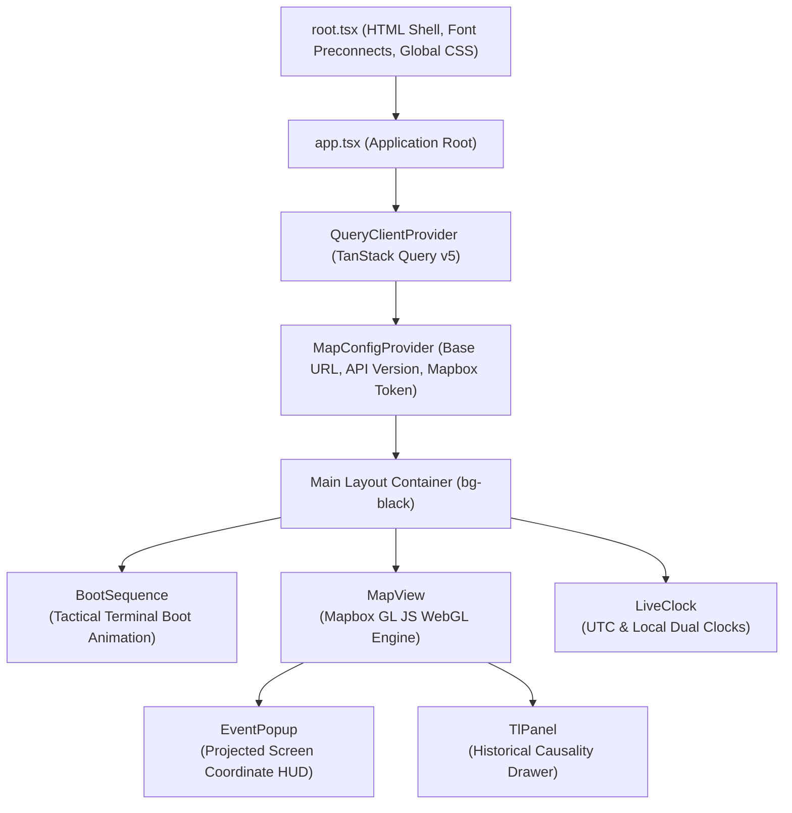
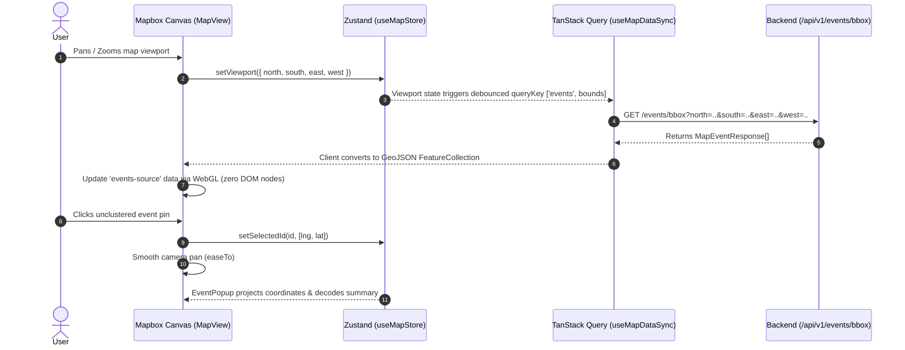

# Hermes Frontend (`hermes`)

**Hermes Frontend** is the client application shell for [Project Hermes](file:///home/pavan/proj/hermes/README.md). Built with **React 19**, **React Router 8** (SPA mode via Vite), **Tailwind CSS 4**, **Zustand**, and **Mapbox GL JS**, it provides an interactive, data-dense geospatial interface that transforms traditional text-heavy news feeds into a dynamic global map.

---

## Table of Contents

- [1. Application Role & Architecture](#1-application-role--architecture)
  - [The 80/20 Monorepo Shell Pattern](#the-8020-monorepo-shell-pattern)
  - [Component & Provider Hierarchy](#component--provider-hierarchy)
  - [Data Flow & Viewport Synchronization](#data-flow--viewport-synchronization)
- [2. "Mission Control" UI/UX Design Language](#2-mission-control-uiux-design-language)
  - [Strict Visual Rules](#strict-visual-rules)
  - [Color Palette & Theme Tokens](#color-palette--theme-tokens)
  - [Terminal HUD Components](#terminal-hud-components)
- [3. Mapbox GL & WebGL Native Layer Pipeline](#3-mapbox-gl--webgl-native-layer-pipeline)
  - [Layer Hierarchy](#layer-hierarchy)
  - [Data-Driven Styling & Marker Ranking](#data-driven-styling--marker-ranking)
  - [Dynamic Timeline Graph Layering](#dynamic-timeline-graph-layering)
- [4. State Management Architecture](#4-state-management-architecture)
  - [Zustand Global Map Store](#zustand-global-map-store)
  - [TanStack Query v5 Data Fetching](#tanstack-query-v5-data-fetching)
- [5. Codebase Anatomy](#5-codebase-anatomy)
- [6. Configuration & Environment Variables](#6-configuration--environment-variables)
- [7. Development & Nx Monorepo Workflow](#7-development--nx-monorepo-workflow)

---

## 1. Application Role & Architecture

### The 80/20 Monorepo Shell Pattern

In accordance with Hermes monorepo guidelines, `apps/hermes` serves strictly as a **lightweight routing and configuration shell**:

- **App Shell (`apps/hermes`)**: Owns application bootstrapping, environment variable injection, global HTML root layout, route definitions, and root providers.
- **Feature Libraries (`libs/feature-map`)**: Owns the Mapbox GL canvas, map lifecycle hooks, custom projection event listeners, timeline panels, and Zustand map state stores.
- **Shared UI Libraries (`libs/shared/ui-components`)**: Owns decoupled tactical HUD widgets (boot sequence animations, military-style live clocks).
- **Shared Types (`libs/shared/util-types`)**: Defines TypeScript interfaces representing backend DTO contracts.

---

### Component & Provider Hierarchy



---

### Data Flow & Viewport Synchronization

Data flows unidirectionally between user viewport interactions, the Zustand global store, TanStack Query, and native Mapbox GeoJSON sources:



---

## 2. "Mission Control" UI/UX Design Language

Hermes adopts a **Mission Control** aesthetic inspired by tactical defense command centers and Bloomberg financial terminals.

### Strict Visual Rules

1. **Zero Border Radius**: All cards, modals, buttons, badges, and popups feature completely sharp, square edges (`border-radius: 0px`). This is strictly enforced at the Tailwind compilation level in [`tailwind.config.js`](file:///home/pavan/proj/hermes/apps/hermes/tailwind.config.js#L25-L27) via `corePlugins: { borderRadius: false }`.
2. **Glassmorphism**: Translucent floating containers use high background blur (`bg-hud-bg/95 backdrop-blur-md`) with glowing tactical borders (`border border-hud-border`).
3. **Monospaced Typography**: All displays prioritize `"JetBrains Mono"` and `"Fira Code"` to preserve columnar data density and alignment.
4. **Single-Page Application (SPA) Mode**: Configured with `ssr: false` in [`react-router.config.ts`](file:///home/pavan/proj/hermes/apps/hermes/react-router.config.ts#L4) to eliminate SSR hydration mismatches with browser-dependent WebGL canvases.

### Color Palette & Theme Tokens

Configured in [`tailwind.config.js`](file:///home/pavan/proj/hermes/apps/hermes/tailwind.config.js) and imported into [`styles.css`](file:///home/pavan/proj/hermes/apps/hermes/styles.css):

| Token | Value | Description |
| :--- | :--- | :--- |
| `hud-bg` | `rgba(10, 15, 25, 0.85)` | Deep semi-transparent tactical navy/black |
| `hud-border` | `#1e3a8a` | Classic dark military navy border |
| `hud-glow` | `#3b82f6` | Radiant electric blue for active focus rings |
| `neon-blue` | `#00f0ff` | High-contrast cyberpunk cyan for headings & telemetry |
| `warning-yellow` | `#fbbf24` | Alert yellow for highlights, ranks, and status indicators |

---

### Terminal HUD Components

- **[`BootSequence`](file:///home/pavan/proj/hermes/libs/shared/ui-components/src/lib/BootSequence.tsx)**: Displays an ASCII command-center boot sequence with simulated satellite uplink initialization, memory scans, and telemetry checks before revealing the live interface.
- **[`LiveClock`](file:///home/pavan/proj/hermes/libs/shared/ui-components/src/lib/LiveClock.tsx)**: Persistent upper-right tactical widget rendering synchronized UTC and Local timestamps alongside a blinking heartbeat monitor.
- **[`EventPopup`](file:///home/pavan/proj/hermes/libs/feature-map/src/lib/ui/components/EventPopup.tsx)**: Floating HUD window that tracks geographic coordinates via `requestAnimationFrame` projection calculations (`map.project()`). Features an automatic cybernetic text-scrambler decode effect on summaries and direct links to original news sources.
- **[`TlPanel`](file:///home/pavan/proj/hermes/libs/feature-map/src/lib/ui/components/TlPanel.tsx)**: Slide-out intelligence dossier rendering historical causal events, Wikipedia context, and interactive map camera hops to historical sub-event coordinates.

---

## 3. Mapbox GL & WebGL Native Layer Pipeline

All geospatial points and relationship lines are rendered directly within Mapbox's WebGL context via native layers. **HTML DOM markers are strictly forbidden** to ensure silky 60 FPS performance when displaying thousands of active events.

### Layer Hierarchy

| Layer ID | Type | Source | Purpose |
| :--- | :--- | :--- | :--- |
| `hermes-clusters` | `circle` | `events-source` | Grouped events with data-driven circle radius scaling (`[20, 10, 30, 50, 40]`) |
| `hermes-cluster-count` | `symbol` | `events-source` | Numeric badge rendering `point_count_abbreviated` in JetBrains Mono |
| `hermes-unclustered-point` | `circle` | `events-source` | Individual breaking news pins with category-based colors and rank-scaled radius |
| `tl-edges-layer` | `line` | `tl-edges-source` | Dashed cyan vector lines (`#00f0ff`) connecting causal timeline nodes |
| `tl-nodes-layer` | `circle` | `tl-nodes-source` | Sub-event historical nodes with category colors or cyan fallbacks |

---

### Data-Driven Styling & Marker Ranking

Unclustered markers utilize data-driven Mapbox expressions to dynamically size pins according to their editor ranking:

```javascript
'circle-color': ['get', 'category_color'],
'circle-radius': ['match', ['get', 'rank'], 
  1, 18,  // Top-ranked global story (largest pin)
  2, 14,  // Second-ranked story
  3, 10,  // Third-ranked story
  6       // Standard event pin
],
'circle-stroke-width': 1,
'circle-stroke-color': '#ffffff'
```

---

### Dynamic Timeline Graph Layering

When a user initiates timeline mode on an event, [`TlPanel`](file:///home/pavan/proj/hermes/libs/feature-map/src/lib/ui/components/TlPanel.tsx) injects historical coordinates and causal graph edges:

- **Nodes**: Rendered as circles at historical geographic coordinates.
- **Edges**: Directional `LineString` features connecting causal sub-events to successor incidents.
- **Terminal Stitching**: The active current event is dynamically appended as the final node (`"current-event"`), visually connecting centuries of historical context directly into today's breaking news.

---

## 4. State Management Architecture

### Zustand Global Map Store

Centralized in [`libs/feature-map/src/lib/store/store.ts`](file:///home/pavan/proj/hermes/libs/feature-map/src/lib/store/store.ts):

```typescript
interface MapState {
  selectedEventId: string | null;
  selectedEventLngLat: [number, number] | null;
  viewport: BoundingBox | null;
  isTlMode: boolean;
  tlTargetId: string | null;

  setSelectedEventId: (id: string | null, lngLat?: [number, number] | null) => void;
  setViewport: (viewport: BoundingBox) => void;
  setTlMode: (active: boolean, targetId?: string | null) => void;
}
```

Both the Mapbox map instance and React HUD overlays react to and update this single source of truth. Neither component maintains detached shadow state.

---

### TanStack Query v5 Data Fetching

- **`useMapDataSync()`**: Observes `state.viewport`. Upon pan/zoom, triggers a bounding box fetch clamped to valid coordinate ranges (`[-90, 90]` latitude, `[-180, 180]` longitude). Cache is kept fresh with a 5-second `staleTime`.
- **`useEventDetails(eventId)`**: Loads full article titles, source metadata, and detailed AI summaries when an event pin is selected (`staleTime: 60000`).
- **`useTl(eventId)`**: Manages historical timeline requests. If the backend returns `status === 'GENERATING'`, the hook automatically polls at a 3-second cadence until graph synthesis completes.

---

## 5. Codebase Anatomy

```text
apps/hermes/
├── Dockerfile                     # Alpine Node 22 container for standalone frontend serving
├── vite.config.mts                # Vite bundler config (@react-router/dev/vite, Tailwind v4)
├── react-router.config.ts         # React Router 8 configuration (SPA mode: ssr = false)
├── tailwind.config.js             # Theme tokens, font families, zero border radius rule
├── postcss.config.js              # PostCSS plugins (@tailwindcss/postcss)
├── styles.css                     # Tailwind @import, Mapbox GL CSS, custom scrollbars
├── package.json                   # Project descriptor (@hermes/hermes)
├── project.json                   # Nx project metadata & tags (scope:frontend, type:app)
├── app/
│   ├── root.tsx                   # Document shell (head, metadata, fonts, scripts)
│   ├── app.tsx                    # Main application orchestration (Providers, MapView, HUD)
│   ├── routes.tsx                 # Route declarations (index -> app.tsx, about -> about.tsx)
│   ├── entry.client.tsx           # Client hydration entry point
│   ├── entry.server.tsx           # Server streaming response handler (fallback for bots)
│   └── routes/
│       └── about.tsx              # Diagnostic/about route
└── tests/
    └── routes/
        └── _index.spec.tsx        # React Router stub unit tests

libs/
├── feature-map/                   # Mapbox GL engine, timeline panel, event popup, map store
│   └── src/lib/
│       ├── ui/map-view.tsx        # Mapbox container, camera controls, WebGL layers
│       ├── ui/components/
│       │   ├── EventPopup.tsx     # Geographic coordinate-projected popup card
│       │   └── TlPanel.tsx        # Historical causal timeline slide-out drawer
│       ├── store/store.ts         # Zustand global map state store
│       ├── hooks/
│       │   ├── datasync.ts        # TanStack Query hook syncing viewport bounding box
│       │   ├── eventDetails.ts    # Event detail query hook
│       │   └── useTl.ts           # Timeline generation and polling hook
│       └── config-context.tsx     # Map configuration React Context Provider
└── shared/
    ├── ui-components/             # Reusable HUD widgets
    │   └── src/lib/
    │       ├── BootSequence.tsx   # Tactical terminal startup sequence
    │       └── LiveClock.tsx      # Dual UTC/Local synchronized digital clock
    └── util-types/                # Shared TypeScript contracts
        └── src/lib/api-types.ts   # MapEventResponse, EventDetailResponse, TlResponse
```

---

## 6. Configuration & Environment Variables

The frontend expects environment variables prefixed with `VITE_` (read via `import.meta.env`):

| Variable | Type | Required | Description |
| :--- | :--- | :--- | :--- |
| `VITE_MAPBOX_TOKEN` | String | **Yes** | Public Mapbox GL access token with styles read permission |
| `VITE_BASE_URL` | String | **Yes** | Backend API origin (e.g. `http://localhost:8000`) |
| `VITE_API_VER` | String | **Yes** | API version slug (e.g. `v1`) |
| `HOST` | String | No | Local network binding host (default: `localhost`, `0.0.0.0` in Docker) |

Variables can be placed in `.env` at the monorepo root or supplied during Docker execution.

---

## 7. Development & Nx Monorepo Workflow

All commands must be executed from the **monorepo root**:

```bash
# 1. Start development server with hot-module reload (default port: 4200)
npx nx dev hermes

# 2. Build production assets to dist/
npx nx build hermes

# 3. Preview production build locally (default port: 4300)
npx nx preview hermes

# 4. Run unit and component test suites with Vitest
npx nx test hermes

# 5. Run ESLint checks
npx nx lint hermes

# 6. Run end-to-end integration tests with Playwright
npx nx e2e hermes-e2e
```
