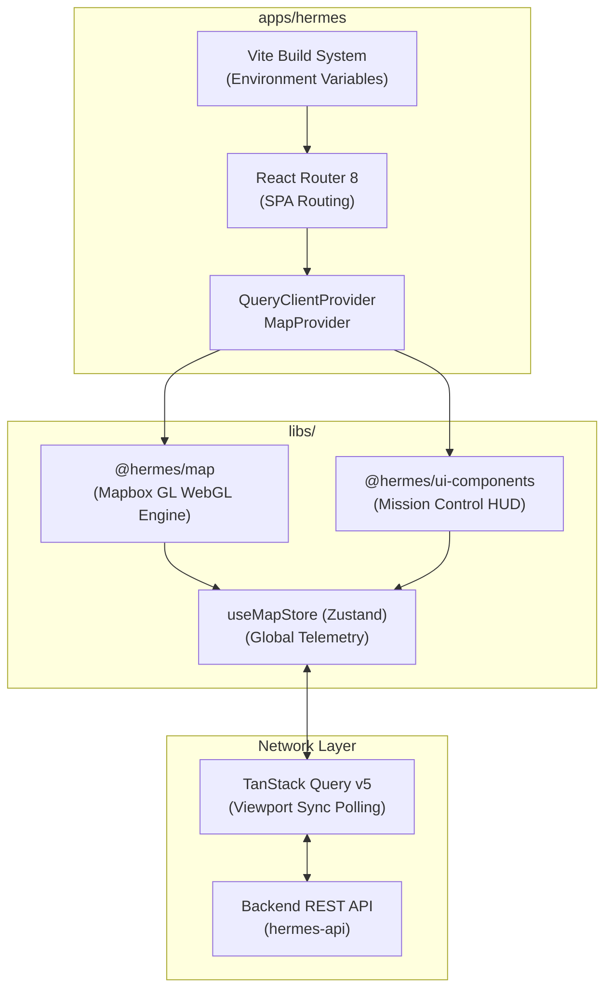

# Hermes React Client (Frontend Shell)

The `hermes` application is the React 19 frontend shell for the Hermes platform. It serves as the primary entry point for the user interface, wrapping the core WebGL map engine and tactical HUD components into a cohesive Single Page Application (SPA).

---

## Architecture Overview

This frontend shell is intentionally kept thin, adhering to the Nx 80/20 monorepo principle. The heavy lifting for map rendering, state management, and HUD UI elements is delegated to libraries in the `libs/` directory. The primary responsibilities of this app are:

1. **Routing**: Utilizing React Router 8 in strict SPA mode.
2. **Environment Configuration**: Loading build-time variables via Vite.
3. **Provider Wrapping**: Initializing TanStack Query and global contexts.
4. **Layout Assembly**: Piecing together the HUD and Map components.

### Structural Flow

```mermaid
flowchart TD
    subgraph App Shell ["apps/hermes"]
        Vite["Vite Build System
(Environment Variables)"]
        Router["React Router 8
(SPA Routing)"]
        Providers["QueryClientProvider
MapProvider"]
    end

    subgraph Core Libraries ["libs/"]
        MapLib["@hermes/map
(Mapbox GL WebGL Engine)"]
        HUDLib["@hermes/ui-components
(Mission Control HUD)"]
        StoreLib["useMapStore (Zustand)
(Global Telemetry)"]
    end

    subgraph Network Layer
        TanStack["TanStack Query v5
(Viewport Sync Polling)"]
        REST["Backend REST API
(hermes-api)"]
    end

    Vite --> Router
    Router --> Providers
    Providers --> MapLib
    Providers --> HUDLib
    MapLib --> StoreLib
    HUDLib --> StoreLib
    StoreLib <--> TanStack
    TanStack <--> REST
```

---

## Core Technologies

- **React 19**: Modern concurrent rendering capabilities.
- **Vite**: Blazing fast build tooling and hot module replacement.
- **Tailwind CSS 4**: Utility-first styling with zero-border-radius constraints applied globally.
- **React Router 8**: Client-side routing. Note: Server-Side Rendering (SSR) is strictly disabled to ensure full compatibility with the WebGL map engine.

---

## Environment Configuration

The application requires specific environment variables injected at build time. These are managed via `.env` files and mapped securely by Vite using the `VITE_` prefix.

| Variable | Description |
| :--- | :--- |
| `VITE_MAPBOX_TOKEN` | Mandatory public token for initializing Mapbox GL JS map layers. |
| `VITE_BASE_URL` | The HTTP endpoint for the backend API (e.g., `http://localhost:8000`). |
| `VITE_API_VER` | The API version suffix for routing (e.g., `v1`). |

---

## Integration with Shared Libraries

The real power of the client resides in its interactions with the shared workspace libraries:

- **`libs/map`**: Provides the `MapView`, clustering logic, layer generation, and the `useMapStore` Zustand state that holds the current viewport coordinates.
- **`libs/shared/ui-components`**: Supplies the highly-stylized, tactical components like `BootSequence`, `LiveClock`, and `MissionStatus` indicators.

---

## Development & Build Commands

Execute these commands from the root of the workspace.

| Target | Command | Description |
| :--- | :--- | :--- |
| **Development** | `npx nx dev hermes` | Start the Vite server on port 4200. |
| **Production Build** | `npx nx build hermes` | Generate minified production assets in `dist/`. |
| **Linting** | `npx nx lint hermes` | Run ESLint strict checks. |
| **Testing** | `npx nx test hermes` | Run unit tests via Vitest. |
