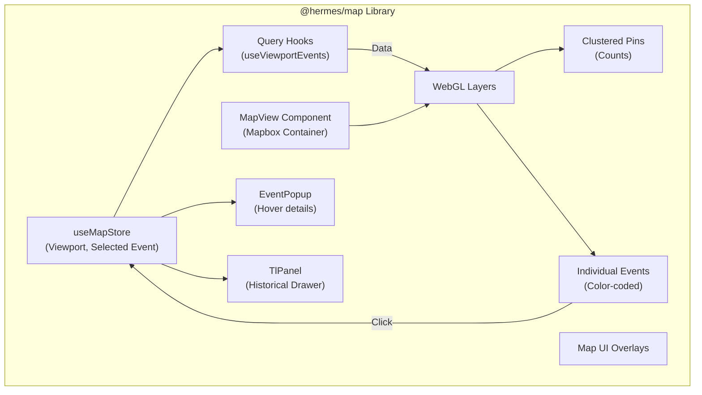

# Hermes Map Library

The `@hermes/map` library is the core visualization engine of the frontend application. It encapsulates all Mapbox GL WebGL complexities, global viewport state management, and real-time clustering algorithms.

---

## Responsibilities & Architecture

By extracting map logic into a dedicated library, the main `apps/hermes` shell remains clean and focused solely on routing. This library handles:

1. **Native WebGL Contexts**: Instantiating and managing the Mapbox map instance safely without polluting React state.
2. **Global Telemetry**: Managing the `useMapStore` Zustand store, which tracks the exact geographical bounding box of the user's viewport.
3. **Data-Driven Styling**: Utilizing Mapbox expression languages to dynamically style pins, colors, and cluster sizes based on incoming data.
4. **Data Synchronization**: Providing TanStack Query hooks that automatically poll the backend API whenever the viewport changes.

### Component Composition



---

## Core Principles & Nuances

### 1. Map Instance References
A critical standard enforced in this library: **The Mapbox GL `Map` instance is NEVER stored in React `useState`.** Storing the massive, heavily mutated WebGL object in React state triggers catastrophic performance degradation and infinite re-renders. It is strictly maintained in a `useRef`.

### 2. Viewport Debouncing
To prevent bombarding the `hermes-api` with thousands of requests as a user pans the map, the bounding box coordinates are heavily debounced inside the Zustand store before they trigger the TanStack Query fetch cycle.

### 3. Clustering Engine
Instead of rendering DOM markers (which crush browser performance past a few hundred nodes), this library relies on native Mapbox symbol and circle layers. Events are grouped at lower zoom levels, and the cluster radius scales dynamically based on the volume of enclosed events.

---

## File Structure

```text
libs/map/
├── src/
│   ├── lib/
│   │   ├── hooks/            # TanStack Query data fetching (useViewportEvents.ts)
│   │   ├── store/            # Zustand global map state (useMapStore.ts)
│   │   └── ui/               # React components (MapView.tsx, EventPopup.tsx, TlPanel.tsx)
│   └── index.ts              # Public API barrel export
├── README.md
└── package.json
```
