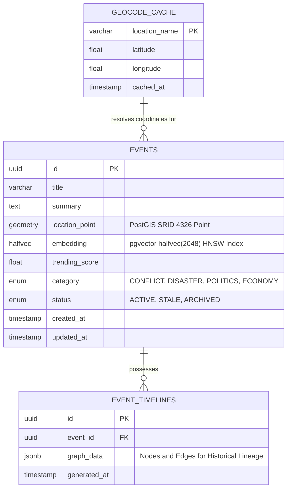

# Hermes Shared Database Library

The `hermes-db` library serves as the central source of truth for the entire platform's data layer. It houses the SQLAlchemy 2.0 ORM models, PostGIS geospatial configurations, `pgvector` index definitions, and Alembic database migrations.

By centralizing the database logic, both the `hermes-api` (read operations) and the `hermes-worker` (write/ingest operations) guarantee perfect schema synchronization and type safety.

---

## Architectural Posture

This library acts strictly as a dependency provider. It does not expose REST endpoints or run background loops. It dictates the structural integrity of the PostgreSQL 16 database.

### Entity-Relationship Schema

---

## Advanced Database Features

### 1. Spatial Geometry (PostGIS)
The `location_point` column on the `Events` table utilizes the PostGIS `Geometry(POINT, 4326)` type. This allows the backend to execute highly performant `ST_Within` bounding-box queries, isolating millions of rows to just the coordinates visible on the user's screen in milliseconds.

### 2. Vector Similarity Indexing (pgvector)
To handle semantic deduplication at scale, the `embedding` column uses the `halfvec(2048)` data type. Half-precision floats significantly reduce RAM footprint without compromising search accuracy. Furthermore, an **HNSW (Hierarchical Navigable Small World)** index with `halfvec_cosine_ops` guarantees ultra-fast nearest-neighbor lookups for real-time article clustering.

### 3. Asynchronous Database Sessions
The library provides an `async_sessionmaker` configured strictly for asynchronous operations (`asyncpg` driver). This ensures that neither the API nor the Worker blocks the event loop while waiting for database I/O.

---

## Migrations Workflow

Migrations are managed via Alembic and executed strictly from the workspace root using Nx task runners.

| Task | Command | Description |
| :--- | :--- | :--- |
| **Generate Revision** | `npx nx run hermes-db:revision --message="add_table"` | Scans SQLAlchemy models and auto-generates an Alembic migration script. |
| **Apply Migrations** | `npx nx migrate hermes-api` | Applies pending revisions to the database (Note: API target is used for execution context). |
| **Sync Deps** | `npx nx run hermes-db:sync` | Update dependencies. |
